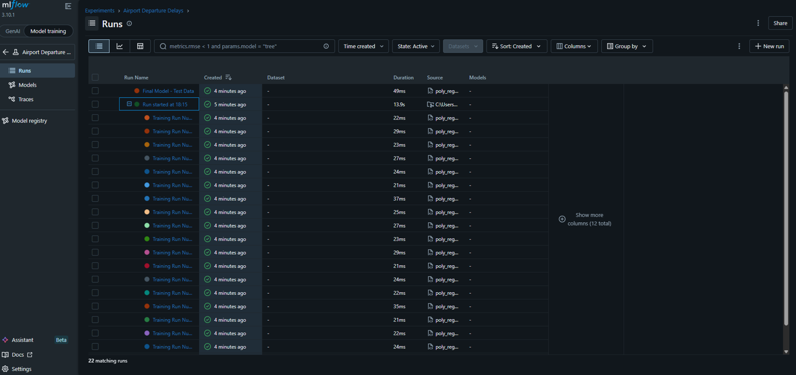
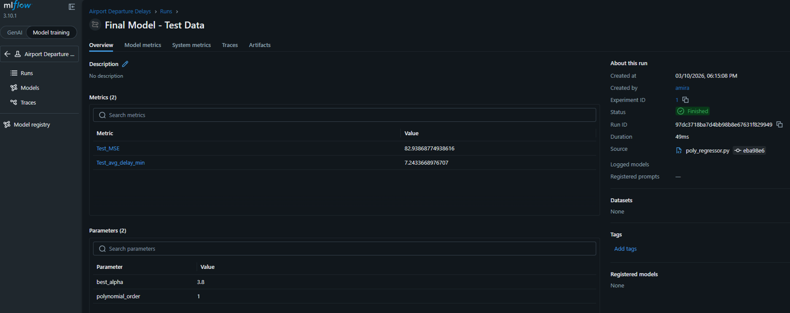
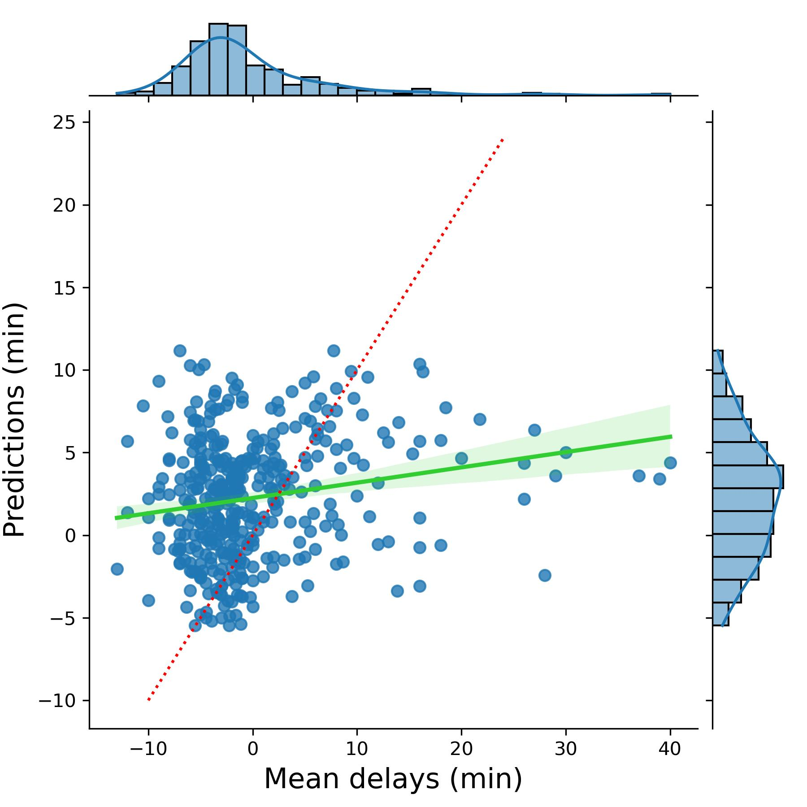

# Branch: `Pipeline` — MLflow Pipeline

## What This Does

The pipeline ingests raw flight reporting data, formats and cleans it for modeling, trains a polynomial ridge regression model with cross-validated alpha selection, and logs all parameters, metrics, and artifacts to an MLflow experiment.

Three scripts are orchestrated sequentially by the `MLProject` file:

```
import_format_data.py  →  filter_clean_data.py  →  poly_regressor.py
```

### Stage 1 — Import & Format (`import_format_data.py`)
- Loads `T_ONTIME_REPORTING.csv` from the `data/` directory
- Drops null values (cancelled flights — not useful for delay prediction)
- Outputs `data/formatted_data.csv`
- Logs process details to `import_format_data_log.txt`

### Stage 2 — Filter & Clean (`filter_clean_data.py`)
- Filters to JFK departures only
- Removes duplicate rows
- Removes extreme delay outliers (> 1000 minutes)
- Outputs `data/cleaned_data.csv`
- Logs process details to `filter_clean_data_log.txt`

### Stage 3 — Train Model (`poly_regressor.py`)
- Trains a polynomial ridge regression model on cleaned data
- Logs to MLflow experiment `"Airport Departure Delays"`:
  - **Parameters:** `best_alpha`, `order` (polynomial degree)
  - **Metrics:** MSE, average predicted delay (minutes)
  - **Artifacts:** log files (`.txt`), performance plot (`.jpg`), `airport_encodings.json`, `finalized_model.pkl`

### MLflow Experiment Output

| MLflow UI — Run List | MLflow UI — Run Detail |
|---|---|
|  |  |

| Performance Plot |
|---|
|  |

---

## Environment Setup

```bash
# Clone the pipeline branch
git clone -b pipeline https://gitlab.com/wgu-gitlab-environment/student-repos/avazir1/d602-deployment-task-2.git

# Create and activate the Conda environment
conda env create -f pipeline_env.yaml
conda activate pipeline_env
```

> MLflow must also be installed in your **base** Conda environment (used to launch the pipeline runner commands).

---

## Running the Pipeline

### Full Pipeline (all 3 stages sequentially)

```bash
mlflow run . -e pipeline --experiment-name "Airport Departure Delays"
```

Default parameters: `num_alphas=20`, `order=1`

### Individual Stages

```bash
mlflow run . -e import_data
mlflow run . -e clean_data
mlflow run . -e train_model --experiment-name "Airport Departure Delays" -P num_alphas=20 -P order=1
```

### Custom Hyperparameters

```bash
mlflow run . -e pipeline -P num_alphas=30 -P order=2 --experiment-name "Airport Departure Delays"
```

### Launch MLflow UI

```bash
mlflow ui
```

> **Important:** Avoid spaces in your project directory name. MLflow tracking URIs use URL encoding (`%20` for spaces), which can cause path resolution failures when running locally.

---

## Dataset Schema

| Column | Type |
|---|---|
| `YEAR` | Integer |
| `MONTH` | Integer |
| `DAY` | Integer |
| `DAY_OF_WEEK` | Integer |
| `ORG_AIRPORT` | String |
| `DEST_AIRPORT` | String |
| `SCHEDULED_DEPARTURE` | Integer |
| `DEPARTURE_TIME` | Integer |
| `DEPARTURE_DELAY` | Integer |
| `SCHEDULED_ARRIVAL` | Integer |
| `ARRIVAL_TIME` | Integer |
| `ARRIVAL_DELAY` | Integer |

---

## Project Structure (`Pipeline`)

```
project/
├── data/
│   ├── T_ONTIME_REPORTING.csv.dvc    # DVC metafile — tracks raw dataset version
│   ├── formatted_data.csv            # Output of Stage 1
│   └── cleaned_data.csv              # Output of Stage 2
├── import_format_data.py             # Stage 1
├── filter_clean_data.py              # Stage 2
├── poly_regressor.py                 # Stage 3
├── MLproject                         # Pipeline orchestration
├── pipeline_env.yaml                 # Conda environment definition
└── README.md
```